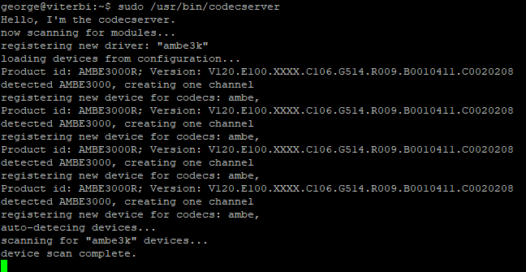
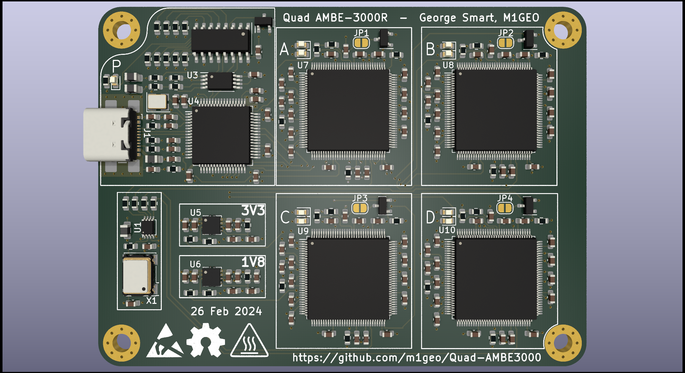
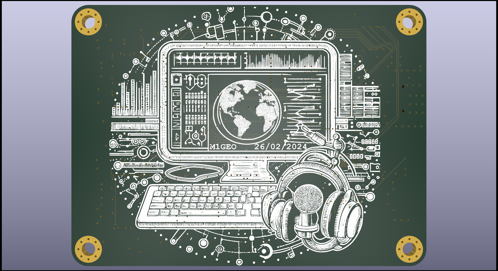

# Quad-AMBE3000
A PCB for four DVSI AMBE-3000R (or AMBE-3003) Vocoders for use with WebSDRs/Audio transcoding.

Using four AMBE-3000R parts was cheaper than using a single AMBE-3003, which was the original plan. 
This is useful for VHF, UHF, SHF WebSDR platforms that decode D-Star, DMR, YSF, NXDN, P25, etc.
A soft-codec approach based on [mbelib](https://github.com/szechyjs/mbelib) can be used, but appeared to give poorer decode audio when tested.

Using four AMBE-3003 parts gives a total of 12 similtaneous transcode streams. the '3003 part requires 1V9 instead of 1V8. You may also benefit from increasing the `S_COM_RATE` to 921,600kbps, by changing `S_COM_RATE0` from low to high. See the devices respective datasheets.

The DVSI AMBE parts can be purchased in low volume from the [DVSI Inc. Hardware Product Pricing](https://www.dvsinc.com/products/price.shtml) page. You will need to create a purchase order to buy from DVSI.

# Assembly

The design schematic include details for [JLCPCB](https://jlcpcb.com/) assembly, who assembled mine. You'll likely have to reflow the DVSI AMBE-3000R part yourself, which I did with a PCB reflow hotplate, but you can do any way you wish.

Each schematic component has a [JLCPCB Parts](https://jlcpcb.com/parts)/[LCSC](https://www.lcsc.com/) part number (Cxxxxxx), which an be exported to the BoM using the extra field "LCSC".

# Schematic

[PDF schematic can be found here](outputs/Quad-AMBE3000_Sch.pdf)

# Images

# 3D Renders

